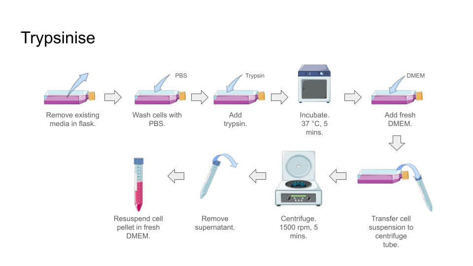

MTT assay
=========
 
**Objective:** To find the toxicity level of a compound toward a cell line. 

.. image:: images/MTT\ assay.png
    :width: 600

Schematics of MTT assay general workflow can be found `here <https://docs.google.com/presentation/d/1bVLtRDbeNUYgCIJIff3_kx7cVitiwAFbNoAo2k-QTZA/edit?usp=sharing>`_. 

The general protocol for MTT with Vero cells was described by :footcite:t:`guillen2022effect,marin2021curcumin`.

MTT assay is a very common assay, you can find a lot of published articles that optimised MTT assays for different purposes. You don't have to strictly follow the parameters in this protocol. The parameters used in this protocol are the ones that is good enough for my experiments. If you are using other cell lines, refer to other sources for different parameters. 

Some important parameters to take note of including: 

    * Number of cells to seed in each well 
    * the amount of reagent to use (PBS, trypsin, DMEM, DMSO, MTT, etc.)
    * time of incubation (12, 24, 36, 48 hrs, etc.) 

The whole MTT assay is a long procedure that can took multiple days. It takes 3 seperate days to complete 1 round of MTT. A typical MTT assay workflow would looks like this:

    * :ref:`Trypsinise, count, and seed cells in a 96 well plate <mtt-part1>` 
    * :ref:`Treatment, treating cells with compounds <mtt-part2>`
    * :ref:`Adding MTT reagent to the well plates and read absorbance <mtt-part3>` 

Planning
--------

Before we actually start the procedure, we need to calculate **number of cells needed** and **amount of media needed** to use for one 96 well plate, with each well contains 100 uL of mixture that contains complete DMEM + number of cells we want for each well. From the **number of cells needed** and **amount of media needed**, we can calculate the **concentration of cells needed**. 

*Number of cells needed*

Assume for 1 compound, we are testing 

    * 8 different concentrations (including negative control) on the cells 
    * 5 wells for each concentration (supposedly we only need 3 for technical replicates, but extra wells were included to compensate for possibly outliers or errors)
    * 5,000 cells in each well
    
then:

    .. code-block::

        Total cells needed = 10 concentrations * 5 wells/concentration * 5,000 cells/well = 250,000 cells (25*10^4 cells)

Take note that even we wanted to test 8 different concentration, but the formula above state :code:`10 concentrations`. This is due to the inevitable deviations or minute errors during pipetting and handling of liquids. If we prepare just enough cell suspension for the exact number of concentrations we want, we might end up not having enough cells for the last few wells, so prepare a little extra amount for some headroom. Usually adding 3 to 5 concentrations extra into the calculation is sufficient.

*Amount of media needed*

Now we need to calculate how much media we need. We would need 100 uL of media in each well. The concept is similar to above section

    .. code-block:: 
    
        Total media needed = 10 concentrations * 5 wells/concentration * 100 uL/well = 5,000 uL 

Similar to above, :code:`10 concentrations` were used in calculation instead of 8 for some extra headroom. 

In total, we need 250,000 cells in 5 mL of media, which makes the concentration :code:`50,000 cells/mL`, or equivalent to :code:`(5*10^4 cells/mL)`.

.. _mtt-part1:

Trypsinise, count, seed
-----------------------

Estimated time needed: 1 hr

*Trypsinise*

First step is to detach the cells from the culture flask. Refer to :ref:`trypsinise <My target>`.

*Cell counting*

We need to know the number of cells since we want to seed a specific number of cells into each well. Refer to :ref:`cell count <cell count>`.  

.. image:: images/Cell\ counting.png
    :width: 600

After counting the cells, we should get value of :code:`X cells/mL`. Compare the counted cell number before we begin the experiment and the calculated cells number. We should have sufficient cells for seeding. 

*Cell seeding*

:ref:`cell seeding for MTT assay <cell seed mtt>`

After we know how much cells we have, we now need to know how much cells we need to take from the cell suspension and dilute in media to make the mixture with the final concentration we want. 

Assume after counting the cells, we have: :code:`300*10^4 cells/mL`, but we only need :code:`5*10^4 cells/mL` (Remember we calculate this value before we begin the procedure). 

Using formula

    .. code-block::

        C1V1 = C2V2
        300*10^4 cells/mL * V1 = 5*10^4 cells/mL * 5 mL
        V1 = 0.0833 mL (~83.3 uL) 
    
In summary, we need to put **83.3 uL of cell suspension** into 4916.7 uL of media. But since the volume difference is negligible, we could just round up to **5,000 uL** of media. 

**Materials**

* 96 well plate 
* Cell reservoir
* Micropipette
* Multichannel micropipette
* Pipette tips 
* Serological pipette 
* Pipette gun 

**Procedure**

#. Mix the cell suspension with either repeat pipetting or vortex. 
#. Add appropriate amount of media into the cell reservoir. 

    * In this example, we should add 5,000 uL (5 mL) of media into the cell resesrvoir.

#. Take required volume of cell suspension and mix with mesdia in the cell reservoir.

    * In this example, add 83.3 uL of cell suspension into the cell reservoir.

#. Mix the cells and media evenly by repeat pipetting using multichannel micropiptte. 
#. Add 100 uL of cells and media mixture from the cell reservoir into the 96 well plate with multichannel micropipette. 
#. Incubate the seeded 96 well plate for 24 hrs at 37 C, 5% CO2. 

.. _mtt-part2:

Treatment
---------

Estimated time needed: 1 hr

* Treatment is where we treat our seeded cells with the compounds we wanted to test. 
* Before treatment, calculate the concentration of compound we need. Usually a serial dilution will do. There are serial dilution calculator online that can help us to calculate the dilution. Refer to :ref:`serial dilution <serial dilution>` section. 
* Assume we seeded cells in 5 different wells for each concentration in the previous step, we would need enough volume of complete DMEM+compound. In this case, :code:`100 uL * 5 wells = 500 uL`, but again, to compansate for pipette error, we can prepare 600 uL, a 100 uL extra. This means after the serial dilution, we should have 600 uL of complete DMEM+compound, with final concentration the we wanted to test in each microcentrifuge tube. 

**Materials**

* :ref:`Complete DMEM <10 dmem>`
* Multichannel micropipette (10-200 uL)
* Micropipette 
* Microcentrifuge tube
* Waste beaker 
* Pipette tips 

**Procedure**

#. Prepare different concentration of compound by diluting the compound in complete DMEM.

    * Prepare the compounds with different concentrations before removing media from the 96 well plate, so we can immediately dispense the compound into the 96 well plate after removing the media. If the cells are left too long whithout media they would dry up and dies.

#. Remove media from 96 well plate with multichannel micropipette. 
#. Add 100 uL of fresh complete DMEM in negative control wells. 
#. Add 100 uL of compound diluted in complete DMEM into respective wells. 
#. Incubate. 24 hrs, 37 C, 5% CO2.

.. _mtt-part3:

Add MTT, read absorbance
------------------------

Estimated time needed: 4 hrs 

* This procedure can be carried out either in the biosafety cabinet or at bench.
* Remember to reduce as much light source as possible (i.e.: turn off lights in lab or in BSC) as MTT is light sensitive. 

**Materials**

* :ref:`MTT reagent (5 mg/mL) <mtt stock>`
* DMSO 
* Multichannel micropipette
* Aluminium foil
* Cell reservoir
* Waste beaker 
* Incubator 
* Microplate reader 
* Plate shaker 

*Add MTT*

**Procedure**

#. Take MTT reagent from freezer and warm to room temperature in water bath or let it sit at bench before use. 
#. Add 10 uL of MTT reagent into each well.

    * **Do not** need to remove media on this step.
    * The MTT reagent concentration is 5 mg/mL, final concentration of MTT reagent in each well is 0.5 mg/mL.
    * Other concentrations of MTT can be used, find out from the literature whichever concentration of MTT that suits your experiments. 

#. Wrap well plates in aluminium foil to keep the MTT reagent from light. 
#. Incubate. 37 C, 5% CO2, 1-4 hrs.

    * There are no strict rules for how long the incubation period should be, you can try to optimise, but be consistant. If you decided to incubate for 2 hrs, then incubate 2 hrs everytime you do MTT assay.  

#. After 1-4 hrs of incubation, remove the 96 well plate from incubator.

    * You can observe the 96 well plate under microscope with 10x magnification to observe the formation of formazan crystals. 

#. Remove media along with remaining MTT solution with multichannel micropipette.  
#. Add 100 uL of DMSO into each well with a multichannel micropipette. 

    * You can use a cell reservoir for DMSO.  

#. Place 96 well plate on shaker and shake for 1 hr.

    * This step is to solubilise the formazan crystal. 
    * You can reduce the time for shaking, as long as the crystals are completely dissolve in DMSO. You can observe the plate under microscope to check if there are undissolved crystals. 

*Read absorbance*

Read the absorbance with a plate reader. 

**Procedure**

#. Read plate at 570 nm. 

    * There are different protocols that uses different wavelength, you may adjust according to literature. 

#. After reading the absorbance, the plate can be disposed into the yellow bin in the lab. 

FAQ
---

There are some parameters that you will need to find out before starting MTT assay. Some common questions you will immediately encounter when you first trying to do MTT assay including:

#. *How many cells to seed in each well?*

    * The common approach is to refer to the published research articles related to the cell lines you are working with to get an idea on how many cells you should seed. 
    * If you cannot get the information you can do some optimisation yourself by trying out any range between 1,000 to 50,000 cells/well. 
    
#. *How many different concentrations you wanted to test with your compound?*

    * Concentrations of compound to test depending on the solubility of the compound in DMSO or other solvent (like water), different compound has different solubility in DMSO. Even if the compound is completely soluble in DMSO, it may precipiate when attempt to dilute with DMEM during serial dilution. 
    * If you have no idea what compound concentrations to use, you can try out by using a larger range of concentrations first. 
    * I typically start with 200 ug/mL and half it for each dilution step (200, 100, 50 ug/mL, etc.). My rationale is that it is easier to find your compound's optimum concentration by screening it with a wider range. If you screen your compound at a narrower range like 20, 40, 60 ug/mL, etc., you might need to do more assays to find out the optimum concentration. So start from wider range, then narrow down if necessary. 

#. *Other common questions including 'How long I should incubate? How much MTT reagent I should use?'*

    * The list of questions are non-exhaustive and can be difficult answer as these parameters are related to multiple factors like what cell lines you are dealing with, what is the purpose of the experiments, etc. 
    * Fortunately, there are a lot of resources you can refer online, or you can simply ask around other lab members who had experience with cell lines that you are using. 
    * For most part, the parameters should be transferrable from one cell line to another. 

Item checklist 
--------------

* Cells 
* Culture flask
* 96 well plate 
* Media
* Micropipette 
* Micropipette tips 
* Cell reservoir 
* Cell counting chamber 
* Click counter 
* Multichannel pipette 
* Waste beaker 
* Trypan blue 
* MTT reagent 
* DMSO 
* Well plate shaker 
* Microplate reader 
* Aluminium foil 
* Microcentrifuge tube 
* Serological pipette 
* Pipette gun 
* Phosphate buffer saline (PBS) 
* Trypsin

References
----------

.. footbibliography:: 