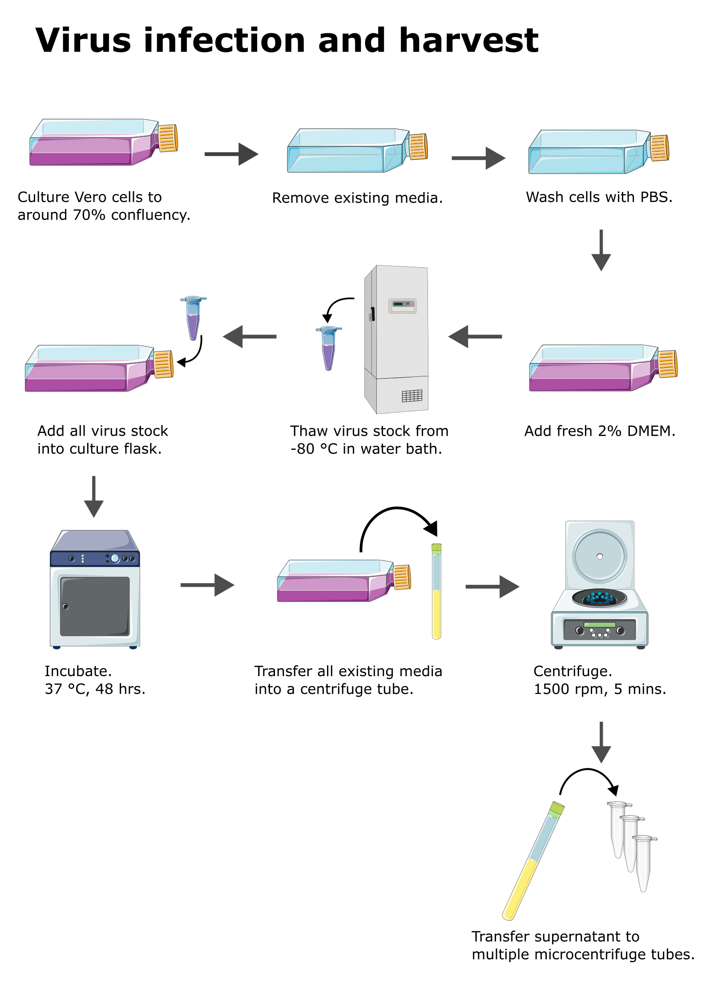

Virus propagation
=================

**Objective:** To propagate virus to make virus stock for virus related experiments. 

* This protocol is modified from :footcite:t:`medina2012dengue`

Schematic workflow of virus stock propagation can be found `here <https://docs.google.com/presentation/d/1lOgmzR994GQ58x71DpZQRM5FnC0vAgz6pWhuMVsuZg0/edit?usp=sharing>`_ 

Infection
---------

Estimated time needed: 10 mins

**Materials**

* :ref:`2% DMEM <2 dmem>`
* Virus stock 
* :ref:`PBS <pbs>`
* Serological pipette 
* Pipette gun 
* Micropipette (100-1000 uL)
* Pipette tips (1000 uL)
* Waste beaker
* Paper towel
* Rack
* Vero cells in culturing flask, around 70% confluency

**Procedure**

#. Remove existing media from culture flask. 
#. Wash cells with PBS. 
#. Add fresh 2% DMEM into the culture flask.
#. Retrieve virus stock from -80 C. 
#. Thaw virus stock in water bath at 37 C. 
#. Add virus stock into culture flask.
#. Incubate. 37 C, 3 to 5 days.
#. Monitor daily under microscope for CPE formation and detachment of cells.
#. When more than 90% of the cells detached from the culture flask, the virus is ready for harvest. 

Harvest
-------

Estimated time needed: 30 mins

**Materials**

* Centrifuge tube (15 ml)
* Microcentrifuge tube 
* Micropipette 
* Pipette tips 

**Procedure**

#. Prepare and label multiple microcentrifuge tube. 

    * Label example: :code:`Virus type, passage number, date, name initials`

#. Take out the culture flask infected with virus. 
#. Transfer all existing media into a 15 ml centrifuge tube. 
#. Centrifuge. 1500 rpm, 5 mins. 
#. Transfer 200-500 uL of supernatant into each labelled microcentrifuge tube. Be careful not to disturb the sediments when transferring the media. 
#. Seal the microcentrifuge tube with parafilm. 
#. Snap freeze the microcentrifuge tube by submerge into liquid nitrogen for about 20-30 secs. 
#. Store the snap frozen microcentrifuge tube in -80 C. 

**Note** 

* A T25 flask with 5 mL media should be enough for around 10 tubes of virus stock. A T75 flask with 10 mL media can give more tubes, around 20 tubes.  
* The harvested virus stock need to have its virus titer quantified using :ref:`plaque assay <plaque assay>`. 

References
----------

.. footbibliography::