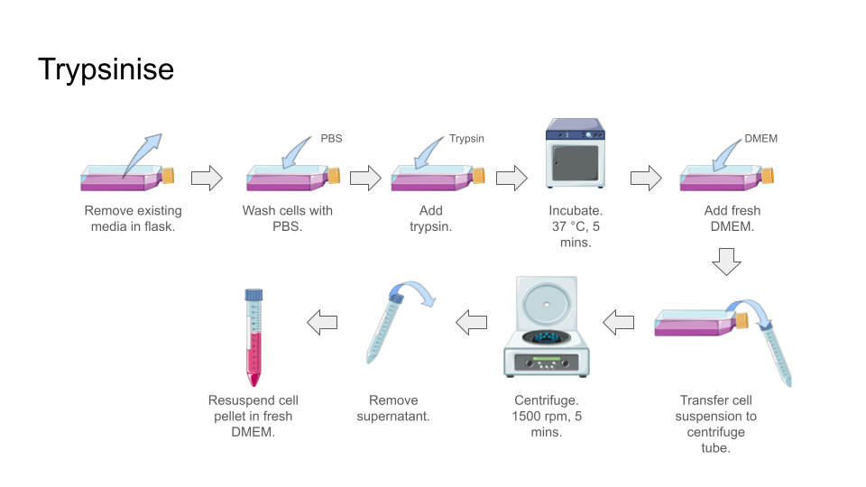

.. _My target:

Trypsinise
==========

**Materials**

* Trypsin/TrypLE 
* :ref:`Complete DMEM <10 dmem>`
* :ref:`PBS (1x) <pbs>`
* Centrifuge tube (15 mL)
* Micropipette 
* Pipette tips 
* Serological pipette 
* Pipette gun

**Procedure**

#. Check the cells under microscope before procedure to confirm the cell is at desired confluency. 
#. Remove existing media from culture flask with serological pipette. 
#. Add PBS into culture flask. 

    * There are no fixed volume, main purpose is to rinse the cells and remove DMEM from the cells.
    * Around 500 uL for T25 flask and 1 mL for T75 flask should be sufficient. 

#. Remove PBS.
#. Add TrypLE.

    * No fixed volume, main purpose is to detach the cells from the culture flask. Add enough volume to cover all the cells. 
    * Around 500 uL for T25 flask and 1 mL for T75 flask should be sufficient. 

#. Incubate the culture flask for about 3 to 5 mins, but not more than 10 mins.

    * Trypsin can be detrimental to cells if exposed for long period of time. 

#. Remove culture flask from incubator. Tap the culture flask to mechanically detach the cells from the flask. 
#. Observe the culture flask under microscope. 

    * This step is to observe how much cells have detached.
    * Ideally, the cells should be round in shape and flowing around, indicating the cells were sucessfully trypsinised and detached from the base of culture flask. You can shake the flask lightly to observe the movement of the cells. 
    * Sometimes you will see the cells are round in shape, but did not detach. Before proceeed into next step, there are some steps you can try to salvage more of the cells including: 

        * incubate the flask for another few mins; or  
        * add more TrypLE, then incubate for another few mins 

    * Not 100% of the cells can be detached, sometimes it is just not possible to detach all the cells. It is ok to proceed to next step if 80-90% of the cells detached from the flask.  

#. Add the amount of complete medium equal to the amount of TrypLE used. 

    * If used 1 mL of TrypLe for trypsinise, then add 1 mL of complete medium to neutralise the TrypLE.

#. Transfer the neutralised cell suspension into a 15 mL centrifuge tube. 
#. Centrifuge. 1,500 rpm, 5 mins. 
#. Remove supernatant, but leave minimal amount of liquid in the centrifuge tube. 

    * Can use either micropipette or serological pipette, but be more cautious when using serological pipette as the pipette gun has stronger suction, which might suck out the cell pellet. 

#. Flick or tap the centrifuge tube to break the cell pellet. 
#. Add 1 mL fresh complete medium and resuspend the cell pellet. Pipette repeatedly to break the cell pellet completely. 
#. The cell suspension can now be used for further processing or experiments. 

*Cells not detach properly*

It is normal that the cells cannot be harvest completely, there are always some cells that cannot detach from the flask no matter what you do. Unless there are large number of cells that do not detach after the trypsinise step, you can ignore those cells. If cells do not detach properly after trypsinising, some of the things you can do including:

* Wash the cells few more times to completely remove FBS. 
* As mentioned above, incubate for a longer period of time or add more TrypLE before prolong the incubation period. 