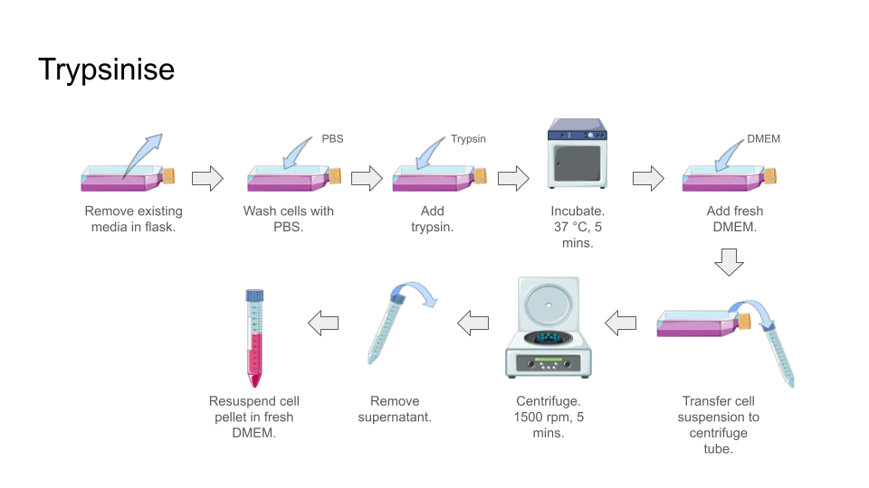

.. _My target:

Trypsinise
==========

**Materials**

* Trypsin/TrypLE 
* :ref:`Complete DMEM <10 dmem>`
* :ref:`PBS (1x) <pbs>`
* Centrifuge tube (15 mL)
* Micropipette 
* Pipette tips 
* Serological pipette 

**Procedure**

#. Check the cells under microscope before procedure to confirm the cell is at desired confluency. 
#. Remove existing media from culture flask with serological pipette. 
#. Add 1-2 mL of PBS into culture flask. 

    * 1 mL for T25 and 2 mL for T75 should be sufficient

#. Remove PBS.
#. Add 1-2 mL of TrypLE.
#. Incubate the culture flask for about 3 to 5 mins, but not more than 10 mins.

    * Trypsin can be detrimental to cells if exposed for long period of time. 

#. Remove culture flask from incubator. Tap the culture flask to mechanically detach the cells from the flask. 
#. Observe the culture flask under microscope. 

    * Not 100% of the cells can be detached from the flask. Ideally most cells (80-90%) should be round in shape and flowing around, indicating the cells were sucessfully trypsinised and detached from the base of culture flask. Shake the flask lightly to check the movement of the cells. 
    * Sometmes cells are round in shape, but did not detach, or only around 50% of cells detached. Then can try to incubate the flask for another few mins or add more TrypLE, then incubate for another few mins 

#. Add the amount of complete medium equal to the amount of TrypLE used. 

    * If used 1 mL of TrypLe for trypsinise, then add 1 mL of complete medium to neutralise the TrypLE.

#. Transfer the neutralised cell suspension into a 15 mL centrifuge tube. 
#. Centrifuge, 1,500 rpm, 5 mins. 
#. Remove supernatant, but leave minimal amount of liquid in the centrifuge tube. 

    * Can use either micropipette or serological pipette, but be more cautious when using serological pipette as the pipette gun has stronger suction, which might suck out the cell pellet. 

#. Add 1 mL fresh medium and resuspend the cell pellet by pipetting repeatedly. 
#. The cell suspension can now be used for further assyas or experiments (seed into flask/96 well plates, etc.). 