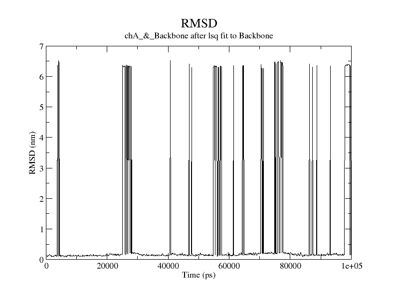

RMSD multi chain protein
========================

Preprocess
----------

* Multichain protein may jump no matter which chain used as center (only chain A, only chain B, or use whole protein, outcome is the same). Therefore, multi step centering was used

#. Center to one chain first, select :code:`chA` for centering

    :code:`gmx trjconv -s md.tpr -f trajout.xtc -n index.ndx -o trajout_center_chainA.xtc -pbc mol -ur compact -center`

#. Center the output from previous step to another chain, select :code:`chB` for centering

    :code:`gmx trjconv -s md.tpr -f trajout_center_chainA.xtc -n index.ndx -o trajout_center_chainB.xtc -pbc mol -ur compact -center`

#. Align structure 

    :code:`gmx trjconv -s md.tpr -f trajout_center_chainB.xtc -n index.ndx -o trajout_fit.xtc -fit rot+trans`

Outcome 
--------

* Only centering to chain A. Least square fit to :code:`Backbone`, :code:`ChainA_backbone` for RMSD calculation

    :code:`gmx rms -s md.tpr -f trajout_center_chainA.xtc -n index.ndx -o rmsd.xvg`

* After multi step centering. Least square fit to :code:`Backbone`, :code:`ChainA_backbone` for RMSD calculation

