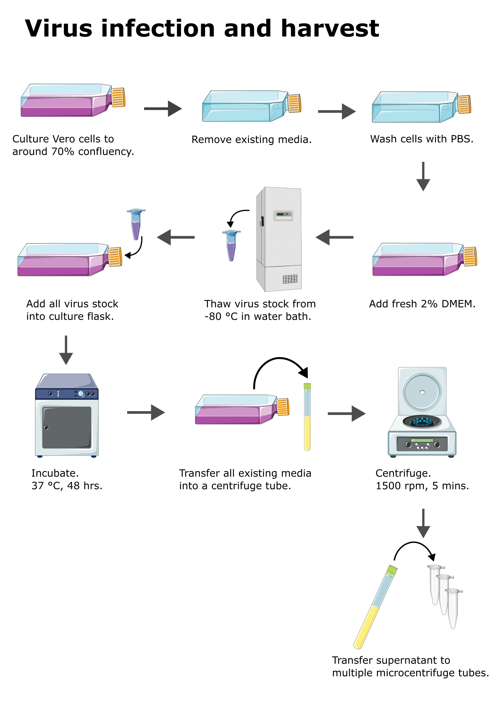

Virus propagation
=================

**Objective:** To propagate virus to make virus stock for virus related experiments. 

* Reference :footcite:p:`medina2012dengue`

Infection
---------

**Requires**

* :ref:`2% DMEM <2 dmem>`
* Virus stock
* :ref:`PBS <pbs>`

**Procedure**

#. Culture Vero cells to about 70% confluency.
#. Remove existing media from culture flask. 
#. Wash cells with PBS. 
#. Add fresh 2% DMEM into the culture flask.
#. Retrieve virus stock from -80 C. 
#. Thaw virus stock in water bath at 37 C. 
#. Add virus stock into culture flask.
#. Incubate. 37 C, 72 to 120 hrs (3 to 5 days).
#. Monitor daily under microscope for CPE formation and detachment of cells.
#. When more than 90% of the cells detached from the culture flask, the virus is ready for harvest. 

Harvest
-------

**Requires**

* Centrifuge tube (15 ml)
* Microcentrifuge tube 

**Procedure**

#. Prepare and label microcentrifuge tube. 

    Label example: :code:`Virus type, passage number, date, name initials`

#. Take out the culture flask infected with virus. 
#. Transfer all existing media into a 15 ml centrifuge tube. 
#. Centrifuge. 1500 rpm, 5 mins. 
#. Transfer 500 uL of supernatant into the labelled microcentrifuge tube. Be careful not to disturb the sediments when transferring the media. 
#. Seal the microcentrifuge tube with parafilm. 
#. Snap freeze the microcentrifuge tube by submerge into liquid nitrogen for about 30 secs - 1 min. 
#. Store the snap frozen microcentrifuge tube in -80 C. 

**Note** 

* A T25 flask with 5 mL media should be enough for around 10 tubes of virus stock. A T75 flask with 10 mL media can give more tubes, around 20 tubes.  
* The harvested virus stock need to have its virus titer quantified using :ref:`plaque assay <plaque assay>`. 
* The volume of virus stock do not have to be 500 uL. Depends on the experiments, we can reduce the volume to make more tubes of virus stock. 

References
----------

.. footbibliography::