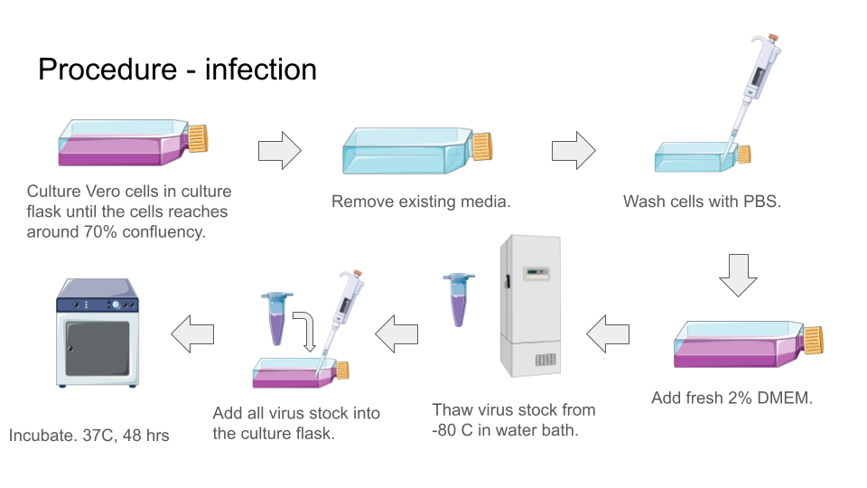

Virus propagation
=================

**Objective:** To propagate virus to make virus stock for virus related experiments. 

Infection
---------

**Requires**

* 2% DMEM
* Virus stock
* PBS

**Procedure**

#. Culture Vero cells to about 70% confluency.
#. Remove existing media from culture flask. 
#. Wash cells with PBS. 
#. Add fresh 2% DMEM into the culture flask.
#. Retrieve virus stock from -80 C. 
#. Thaw virus stock in water bath at 37 C. 
#. Add virus stock into culture flask.
#. Incubate. 37 C, 48 hrs.
#. Monitor daily under microscope for CPE formation and detachment of cells.
#. When more than 90% of the cells detached from the culture flask, the virus is ready for harvest. 

*Note: Dengue virus usually causes the cells to exhibits cytopathic effect (CPE) in 24 hrs. At 48 hrs, most cells should be dead and detached from the base of the flask. You can wait another day (at 72 hrs) to harvest the virus, but don't leave it too long (more than 3 days) in the incubator, there is a very high chance of contamination.* 

Harvest
-------

**Requires**

* Centrifuge tube (15 ml)
* Microcentrifuge tube 

**Procedure**

#. Label 10 microcentrifuge tube. 

    Label example: :code:`Virus type, passage number, date, name initials`

#. Take out the culture flask infected with virus. 
#. Transfer all existing media that contain dead cells and virus into a 15 ml centrifuge tube. 
#. Centrifuge. 1500 rpm, 5 mins. 
#. Aliquote 500 uL of supernatant into the labelled microcentrifuge tube, this is our virus stock. Be careful when aliquot to not disturb the sediments. 
#. Seal the microcentrifuge tube with parafilm. 
#. Snap freeze the microcentrifuge tube by submerge into liquid nitrogen for about 30 secs - 1 min. 
#. Store the snap frozen microcentrifuge tube in -80 C. 

**Note** 

* In a T25 culture flask with 5 ml of 2% DMEM, there should be enough media to aliquote 10 microcentrifuge tube.
* To make more virus, we can use larger flask like T75 and adjust the media volume accordingly. 
* The harvested virus stock need to have its virus titer quantified. We do this by using :ref:`plaque assay <plaque assay>`. 
* The volume of virus stock do not have to be 500 uL. Depends on the experiments, we can reduce the volume to make more tubes of virus stock. 

